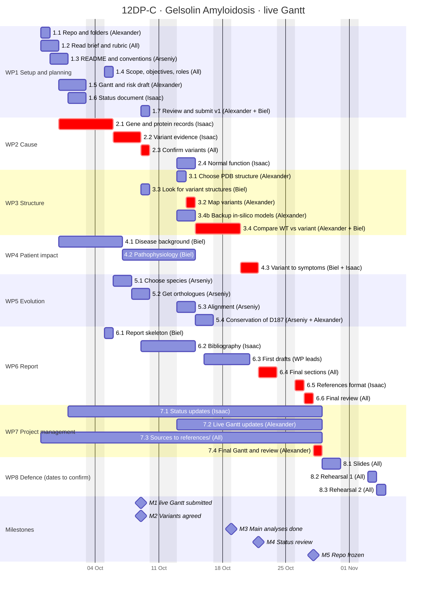

# Gantt (live)

Updated at the end of every week with the real dates (task 7.2). It starts as a copy of [`gantt_v1.md`](gantt_v1.md); at the end of the project we compare both (task 7.4).

Last update: 09/10/2026

