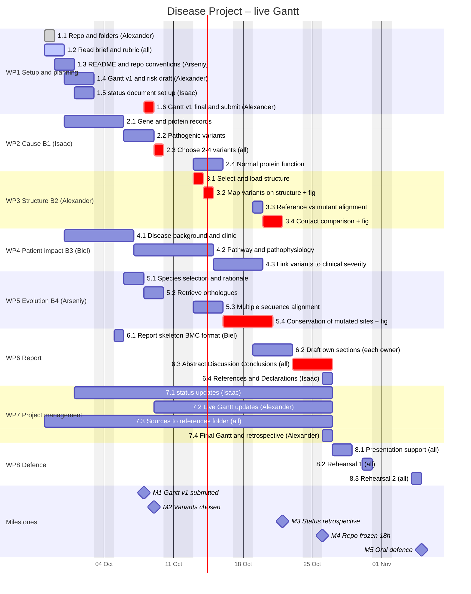

```mermaid
gantt
    title Disease Project – live Gantt
    dateFormat DD-MM-YYYY
    axisFormat %d %b
    excludes weekends, 12-10-2026
    todayMarker on

    section WP1 Setup and planning
    1.1 Repo and folders (Alexander)          :done, t11, 28-09-2026, 1d
    1.2 Read brief and rubric (all)           :active, t12, 28-09-2026, 2d
    1.3 README and repo conventions (Arseniy) :t13, after t11, 2d
    1.4 Gantt v1 and risk draft (Alexander)   :t14, 30-09-2026, 3d
    1.5 status document set up (Isaac)        :t15, 01-10-2026, 2d
    1.6 Gantt v1 final and submit (Alexander) :crit, t16, 08-10-2026, 1d

    section WP2 Cause B1 (Isaac)
    2.1 Gene and protein records              :t21, 30-09-2026, 4d
    2.2 Pathogenic variants                   :t22, after t21, 3d
    2.3 Choose 2-4 variants (all)             :crit, t23, after t22, 1d
    2.4 Normal protein function               :t24, after t23, 3d

    section WP3 Structure B2 (Alexander)
    3.1 Select and load structure             :crit, t31, after t23, 1d
    3.2 Map variants on structure + fig       :crit, t32, after t31, 1d
    3.3 Reference vs mutant alignment         :t33, 19-10-2026, 1d
    3.4 Contact comparison + fig              :crit, t34, after t32 t33, 2d

    section WP4 Patient impact B3 (Biel)
    4.1 Disease background and clinic         :t41, 30-09-2026, 5d
    4.2 Pathway and pathophysiology           :t42, after t41, 5d
    4.3 Link variants to clinical severity    :t43, after t23 t42, 3d

    section WP5 Evolution B4 (Arseniy)
    5.1 Species selection and rationale       :t51, after t21, 2d
    5.2 Retrieve orthologues                  :t52, after t51, 2d
    5.3 Multiple sequence alignment           :t53, after t52, 3d
    5.4 Conservation of mutated sites + fig   :crit, t54, after t53 t23, 3d

    section WP6 Report
    6.1 Report skeleton BMC format (Biel)     :t61, 05-10-2026, 1d
    6.2 Draft own sections (each owner)       :t62, 19-10-2026, 4d
    6.3 Abstract Discussion Conclusions (all) :crit, t63, after t62 t34 t54, 2d
    6.4 References and Declarations (Isaac)   :t64, 26-10-2026, 1d

    section WP7 Project management
    7.1 status updates (Isaac)                :t71, 01-10-2026, 17d
    7.2 Live Gantt updates (Alexander)        :t72, 09-10-2026, 11d
    7.3 Sources to references folder (all)    :t73, 28-09-2026, 20d
    7.4 Final Gantt and retrospective (Alexander) :t74, 26-10-2026, 1d

    section WP8 Defence
    8.1 Presentation support (all)            :t81, 27-10-2026, 2d
    8.2 Rehearsal 1 (all)                     :t82, 30-10-2026, 1d
    8.3 Rehearsal 2 (all)                     :t83, 04-11-2026, 1d

    section Milestones
    M1 Gantt v1 submitted                     :milestone, m1, 08-10-2026, 0d
    M2 Variants chosen                        :milestone, m2, 09-10-2026, 0d
    M3 Status retrospective                   :milestone, m3, 22-10-2026, 0d
    M4 Repo frozen 18h                        :milestone, m4, 26-10-2026, 0d
    M5 Oral defence                           :milestone, m5, 05-11-2026, 0d
```
