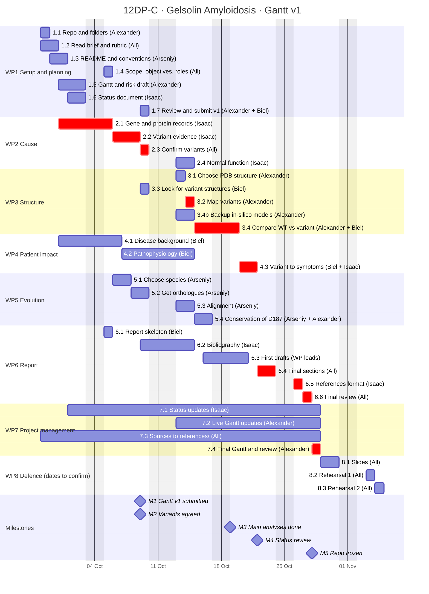

# Molecular basis of Gelsolin Amyloidosis: a structural and comparative analysis of pathogenic GSN variants

**Group 12DP-C** · Introduction to Bioinformatics · 2026–2027

**Members:** Alexander, Arseniy, Biel, Isaac

Gantt chart and risk analysis, version 1 (submitted 9 October 2026).

---

## 1. Project overview and team

### General objective

Explain how the D187N and D187Y variants in the *GSN* gene change the gelsolin protein and lead to Gelsolin Amyloidosis, and check whether the affected region is conserved in horse (*Equus caballus*) and mouse (*Mus musculus*).

### Specific objectives

1. **Cause (WP2):** collect the human *GSN* gene and gelsolin protein records from UniProt, NCBI and Ensembl, and explain why we chose D187N and D187Y.
2. **Structure (WP3):** place both variants on an experimental gelsolin structure and describe what changes around residue 187, especially at the calcium-binding site.
3. **Patient impact (WP4):** connect what happens to the protein with amyloid formation and with the symptoms patients have.
4. **Evolution (WP5):** align human, horse and mouse gelsolin and measure how conserved D187 and the main domains are.

### Milestones

| ID | Milestone | Date |
|---|---|---|
| M1 | Gantt v1 and risk analysis submitted | 09/10/2026 |
| M2 | Variants and residue numbering agreed | 09/10/2026 |
| M3 | Main analyses done (structure comparison and alignment) | 19/10/2026 |
| M4 | Project status review | 22/10/2026 |
| M5 | Repository frozen (final delivery, 18:00) | 28/10/2026 |
| M6 | Oral defence | to be confirmed |

### Team and roles

All four of us are first-year students of the Bachelor's degree in Bioinformatics.

| Member | Role | What they do |
|---|---|---|
| Alexander | Planning and structure | Makes and updates the Gantt, keeps track of deadlines and submits the deliverables. Leads WP1, WP3 and WP7. |
| Arseniy | Sequences and evolution | Gets the horse and mouse sequences and does the alignment and conservation analysis. Leads WP5 and looks after the README and how we use the repo. |
| Biel | Report and clinical side | Decides what goes into the report and makes sure it reads as one text. Leads WP4 and WP6. |
| Isaac | Gene, variants and references | Keeps the status document up to date and the reference list in order. Leads WP2. |

---

## 2. Gantt chart

We count working days only (Monday to Friday). 12 October is a national holiday and is not counted.

Red bars are the critical path: 2.1 → 2.2 → 2.3 → 3.2 → 3.4 → 4.3 → 6.4 → 6.5 → 6.6 → 7.4. If any of these is late, the final delivery is late.

---

## 3. Work packages and tasks

The project runs from 28/09/2026 to 04/11/2026 (27 working days). Days are working days; ★ marks the critical path.

#### WP1 · Setup and planning — lead Alexander · 28/09 – 09/10 · 10 days

| ID | Task | Owner | Output | Days | Dates | Depends on | Done when |
|---|---|---|---|---|---|---|---|
| 1.1 | Create the repo and folders | Alexander | Repo with report/, status/, gantt/, references/, files/ | 1 | 28/09 | — | The repo exists and all four of us can push to it. |
| 1.2 | Read the brief and the rubric | All | List of open questions | 2 | 28/09 – 29/09 | — | We have all read the Overview, Formal Requirements, BMC template and rubric. |
| 1.3 | Write the README and repo rules | Arseniy | README.md | 2 | 29/09 – 30/09 | 1.1 | The README explains the project, the folders and how we name commits. |
| 1.4 | Agree on scope, objectives and roles | All | Section 1 of this file | 1 | 05/10 | 1.2 | Objectives, milestones and roles are written here and we all agree. |
| 1.5 | Draft the Gantt and risk analysis | Alexander | Draft of this file | 3 | 30/09 – 02/10 | 1.2 | Every task has an owner, output, duration, dates and a "done when". |
| 1.6 | Set up the status document | Isaac | status/project_status.md | 2 | 01/10 – 02/10 | 1.1 | The status document lists every task with its owner, dates and status. |
| 1.7 | Review and submit Gantt v1 | Alexander, Biel | Repo link on Moodle + git tag `gantt-v1` | 1 | 09/10 | 1.5, 1.6 | A second person has reviewed it and it is submitted before 22:00. |

#### WP2 · Cause — lead Isaac · 30/09 – 14/10 · 10 days

| ID | Task | Owner | Output | Days | Dates | Depends on | Done when |
|---|---|---|---|---|---|---|---|
| 2.1 ★ | Get the gene and protein records | Isaac | FASTA files + table of IDs | 4 | 30/09 – 05/10 | 1.2 | The human *GSN* and gelsolin sequences are in the repo with their UniProt, NCBI and Ensembl IDs. |
| 2.2 ★ | Collect evidence on pathogenic variants | Isaac | Variant table | 3 | 06/10 – 08/10 | 2.1 | A table lists the known variants with position, change, disease and source. |
| 2.3 ★ | Confirm D187N/D187Y and the numbering | All | Short justification + numbering note | 1 | 09/10 | 2.2 | We have written why we chose these two variants and which numbering we use. |
| 2.4 | Describe how normal gelsolin works | Isaac | Summary of domains and function | 2 | 13/10 – 14/10 | 2.1 | The six domains, calcium activation and actin cutting are explained with references. |

#### WP3 · Structure — lead Alexander · 09/10 – 19/10 · 6 days

| ID | Task | Owner | Output | Days | Dates | Depends on | Done when |
|---|---|---|---|---|---|---|---|
| 3.1 | Choose the reference PDB structure | Alexander | PDB ID + reason | 1 | 13/10 | 2.3 | We have picked one structure and explained why (resolution, domain G2, calcium bound). |
| 3.2 ★ | Show the variants on the structure | Alexander | Figure of D187 in domain G2 | 1 | 14/10 | 2.3, 3.1 | The figure shows residue 187, domain G2 and the calcium site, and it is in files/figures/. |
| 3.3 | Look for structures of the variants | Biel | Search results | 1 | 09/10 | 2.2 | We know whether the PDB has a usable D187N or D187Y structure. |
| 3.4 ★ | Compare normal vs variant around residue 187 | Alexander, Biel | Comparison figure + text | 3 | 15/10 – 19/10 | 3.2, 3.3 | The figure compares calcium binding and contacts in both cases and the differences are explained. |
| 3.4b | Backup: build the variants in PyMOL | Alexander | Modelled structures | 2 | 13/10 – 14/10 | 3.3 | Only if 3.3 finds nothing: the models are saved in the repo and their limits are explained. |

#### WP4 · Patient impact — lead Biel · 30/09 – 21/10 · 15 days

| ID | Task | Owner | Output | Days | Dates | Depends on | Done when |
|---|---|---|---|---|---|---|---|
| 4.1 | Disease background | Biel | Notes with references | 5 | 30/09 – 06/10 | 1.2 | How common it is, how it is inherited and its symptoms are summarised, citing at least one recent review. |
| 4.2 | How the disease develops | Biel | Description of the steps | 5 | 07/10 – 14/10 | 4.1 | Each step from the variant to the amyloid deposits is explained and backed by a source. |
| 4.3 ★ | Link each variant to the symptoms | Biel, Isaac | Short chain per variant | 2 | 20/10 – 21/10 | 2.3, 3.4, 4.2 | For each variant we can go from the protein change to the symptoms, and both agree. |

#### WP5 · Evolution — lead Arseniy · 06/10 – 16/10 · 8 days

| ID | Task | Owner | Output | Days | Dates | Depends on | Done when |
|---|---|---|---|---|---|---|---|
| 5.1 | Choose the species | Arseniy | Short justification | 2 | 06/10 – 07/10 | 2.1 | We have written why we compare with horse and mouse. |
| 5.2 | Get the horse and mouse sequences | Arseniy | FASTA of the 3 sequences | 2 | 08/10 – 09/10 | 2.1, 5.1 | The three sequences are in the repo with their accession numbers and the isoform used. |
| 5.3 | Align the three sequences | Arseniy | Alignment file | 2 | 13/10 – 14/10 | 5.2 | The alignment is in the repo, with the tool and settings written down. |
| 5.4 | Check how conserved D187 is | Arseniy, Alexander | Annotated alignment figure + identity table | 2 | 15/10 – 16/10 | 2.3, 5.3 | Position 187 and the domains are highlighted and identity per domain is in a table. |

#### WP6 · Report — lead Biel · 05/10 – 27/10 · 16 days

| ID | Task | Owner | Output | Days | Dates | Depends on | Done when |
|---|---|---|---|---|---|---|---|
| 6.1 | Report skeleton (BMC format) | Biel | report/report.md | 1 | 05/10 | 1.1 | Every BMC section is there with the name of who writes it. |
| 6.2 | Bibliography | Isaac | Commented reference list | 3 | 09/10 – 14/10 | 4.1 | Every source is listed in Oxford style with one line saying what it is for. |
| 6.3 | First drafts of Background, Methods and Results | Each WP lead | Drafts in report.md | 3 | 16/10 – 20/10 | 4.2, 5.3 | Each part is written and someone else has read it. |
| 6.4 ★ | Final Results, Discussion, Abstract and Conclusions | All | Finished sections | 2 | 22/10 – 23/10 | 4.3, 6.3 | The Abstract is under 350 words and we have all approved the text. |
| 6.5 ★ | Fix references and Declarations | Isaac | Reference list + Declarations | 1 | 26/10 | 6.4 | Every citation in the text is in the list and in Oxford style. |
| 6.6 ★ | Final review (buffer day) | All | Checked report | 1 | 27/10 | 6.5 | Max 7 pages / 5000 words, max 5 figures or tables, and every claim has a source. |

#### WP7 · Project management — lead Alexander · 28/09 – 28/10 · 22 days

| ID | Task | Owner | Output | Days | Dates | Depends on | Done when |
|---|---|---|---|---|---|---|---|
| 7.1 | Keep the status document updated | Isaac | status/project_status.md | 19 | 01/10 – 28/10 | — (alongside 1.6) | Updated at least twice a week with real dates. |
| 7.2 | Keep the live Gantt updated | Alexander | gantt/ | 12 | 13/10 – 28/10 | 1.7 | At the end of each week it shows the real dates. |
| 7.3 | Save every source in references/ | All | PDFs in the repo | 22 | 28/09 – 28/10 | — | Every source we cite has its PDF or saved page in references/. |
| 7.4 ★ | Final Gantt and comparison with v1 | Alexander | Final Gantt + short analysis | 1 | 28/10 | 6.6 | The final Gantt is next to v1 with an explanation of what changed and why. |

#### WP8 · Defence — all · 29/10 – 04/11 · 5 days (dates to confirm when M6 is set)

| ID | Task | Owner | Output | Days | Dates | Depends on | Done when |
|---|---|---|---|---|---|---|---|
| 8.1 | Slides | All | Slides | 2 | 29/10 – 30/10 | 6.6 | The slides cover the main results and each of us presents one part. |
| 8.2 | First rehearsal | All | Feedback notes | 1 | 03/11 | 8.1 | We have done a full run within the time limit and noted what to fix. |
| 8.3 | Second rehearsal | All | Final timing | 1 | 04/11 | 8.2 | Feedback is applied and any of us can answer questions on any part. |

---

## 4. Risk analysis

Each risk gets a likelihood (L) and an impact (I) from 1 to 3. **Score = L × I**: 1–2 Low, 3–5 Medium, 6–9 High. We check the risks every week in the status document.

| ID | Risk | L | I | Score | Level | Owner |
|---|---|---|---|---|---|---|
| R1 | There is no experimental structure of the variants | 2 | 3 | 6 | High | Alexander |
| R2 | Sources number the residue differently (187 vs 214) | 3 | 2 | 6 | High | Isaac |
| R3 | The structure comparison (3.4) takes longer than planned | 2 | 3 | 6 | High | Alexander |
| R4 | One of us is away on a day when a critical task is due | 3 | 2 | 6 | High | Isaac |
| R5 | Horse or mouse records are unreviewed or have several isoforms | 2 | 2 | 4 | Medium | Arseniy |
| R6 | The report goes over the page, word or figure limit | 2 | 2 | 4 | Medium | Biel |
| R7 | We make mistakes with git and GitHub (unneeded branches, wrong merges, lost changes) | 3 | 1 | 3 | Medium | Arseniy |

**R1.** Our identified risk is that there is no experimental structure of gelsolin with D187N or D187Y, we have realized because most gelsolin structures in the PDB are of the normal protein or of single domains; our contingency plan consists of building the two variants in PyMOL on the normal structure (task 3.4b) and saying clearly that they are models, not experimental data. We will know on 9 October, after task 3.3.

**R2.** Our identified risk is that the same residue appears with different numbers (for example D187 and D214), we have realized because papers number the mature protein while UniProt counts the signal peptide too; our contingency plan consists of choosing one numbering in task 2.3, keeping a small conversion table in the repo and checking every number in the final review (6.6).

**R3.** Our identified risk is that the structure comparison (3.4) is late, we have realized because it is the longest task on the critical path and 4.3 and 6.4 wait for it; our contingency plan consists of starting the report drafts (6.3) without waiting for it, keeping 27 and 28 October as buffer, and studying only D187N if 3.4 is not done by 19 October.

**R4.** Our identified risk is that one of us is away on a day when a critical-path task is due, we have realized because several of us travel during the term (Alexander, for example, will be away more than once in October) and the project overlaps with other courses; our contingency plan consists of planning with margin: critical tasks are finished at least one working day before the task that depends on them, 27 and 28 October are kept free as buffer, each work package has a backup member (Alexander ↔ Arseniy, Isaac ↔ Biel), and everyone writes their absences in the status document in advance.

**R5.** Our identified risk is that the horse or mouse/fly gelsolin record is not reviewed or has several isoforms, we have realized because the horse entry may not be curated and gelsolin has a plasma and a cytoplasmic form; our contingency plan consists of using reviewed Swiss-Prot entries when they exist, comparing the same isoform in all three species and cross-checking with Ensembl and RefSeq.

**R6.** Our identified risk is going over 7 pages, 5000 words or 5 figures, we have realized because the disease mechanism plus three analyses is a lot to fit; our contingency plan consists of deciding the figures now (from 3.2, 3.4 and 5.4, plus at most two tables), giving each section a word limit and counting words in task 6.6.

**R7.** Our identified risk is that we make mistakes with git and GitHub, such as creating branches we do not need, merging in the wrong direction or overwriting each other's work, we have realized because we are new to both tools and it has already happened (we created extra branches and one personal branch did not share history with main); our contingency plan consists of each of us working only on our own branch and merging into main through a pull request reviewed by another member, committing often, and asking an LLM to explain each git step before we run it, as the course allows using GenAI to understand concepts (we still run the commands and make the commits ourselves).
